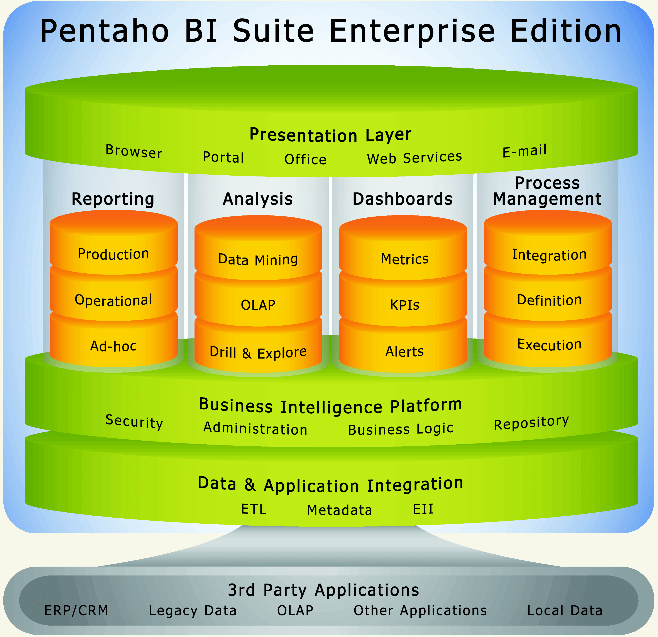

# Tìm Hiểu Về Pentaho

## 1. Giới thiệu về Pentaho:

Pentaho là một nền tảng mã nguồn mở mạnh mẽ dành cho Business Intelligence (BI), cung cấp các giải pháp toàn diện cho việc phân tích, tích hợp và trực quan hóa dữ liệu. Pentaho giúp các doanh nghiệp thu thập, xử lý và trình bày dữ liệu một cách hiệu quả, từ đó hỗ trợ việc ra quyết định dựa trên dữ liệu.

---

## Các tính năng quan trọng:

- Khả Năng ETL Cho Nhu Cầu Kinh Doanh Thông Minh
- Trình Thiết Kế Báo Cáo Pentaho
- Chức Năng Phân Tích Dữ Liệu (OLAP)
- Khai Phá Dữ Liệu và Học Máy
- Trực Quan Hóa Dữ Liệu và Dashboard
- Hỗ Trợ Siêu Dữ Liệu (Metadata)
- Khả Năng Mở Rộng và Tích Hợp

[Chi tiết các tính năng](pentaho_features.md#các-tính-năng-chính-của-pentaho)

---

## Một số hạn chế:

- Độ Phức Tạp Khi Triển Khai
- Hiệu Suất Với Dữ Liệu Lớn
- Hỗ Trợ Hạn Chế Cho Phiên Bản Cộng Đồng
- Tích Hợp Với Một Số Nguồn Dữ Liệu
- Đường Cong Học Tập Cao

[Chi tiết các hạn chế](pentaho_features.md#hạn-chế-của-pentaho)

---

## Các thành phần trong bộ công cụ Pentaho BI

[Giải thích từng phần trong ảnh](pentaho_bi_suite_enterprise.mds)

### 1. Pentaho Reporting

Pentaho Reporting phụ thuộc vào dự án JFreeReport. Thành phần này giúp bạn đáp ứng nhu cầu báo cáo kinh doanh. Nó cung cấp khả năng xuất báo cáo theo lịch trình và theo yêu cầu ở các định dạng phổ biến như XLS, PDF, TXT, và HTML.

### 2. Phân Tích (Analysis)

Nó cung cấp nhiều tính năng phân tích đa dạng, bao gồm cả chế độ xem bảng pivot. Công cụ này cũng cung cấp các tính năng GUI nâng cao (sử dụng Flash hoặc SVG), widget tích hợp trên bảng điều khiển, cổng và tích hợp quy trình làm việc.

Ngoài ra, Pentaho Spreadsheet Services cho phép người dùng duyệt, xoay và sử dụng biểu đồ trực tiếp từ MS Excel.

### 3. Bảng Điều Khiển (Dashboards)

Bảng điều khiển cung cấp nội dung từ Báo cáo và Phân tích, đóng góp vào Pentaho Dashboards. Trình thiết kế bảng điều khiển tự phục vụ bao gồm các mẫu bảng điều khiển và bố cục phong phú. Nó cho phép người dùng kinh doanh tạo bảng điều khiển cá nhân hóa với rất ít hướng dẫn.

### 4. Khai Thác Dữ Liệu (Data Mining)

Công cụ khai thác dữ liệu khám phá các mẫu ẩn và chỉ số về hiệu suất tương lai. Nó cung cấp bộ thuật toán học máy phong phú nhất từ dự án Weka, bao gồm phân cụm, cây quyết định, rừng ngẫu nhiên, phân tích thành phần chính, và mạng nơ-ron.

Công cụ này cho phép bạn xem dữ liệu dưới dạng đồ họa, tương tác với nó một cách lập trình hoặc sử dụng nhiều nguồn dữ liệu cho báo cáo, phân tích sâu hơn và các quy trình khác.

### 5. Tích Hợp Dữ Liệu Pentaho (Pentaho Data Integration)

Thành phần này được sử dụng để tích hợp dữ liệu ở bất cứ nơi nào nó tồn tại.

Thư viện biến đổi phong phú với hơn 150 đối tượng ánh xạ có sẵn. 
Nó hỗ trợ một loạt các nguồn dữ liệu bao gồm hơn 30 nền tảng cơ sở dữ liệu mã nguồn mở và độc quyền, tập tin phẳng. Nó cũng hỗ trợ phân tích Big Data với tích hợp và quản lý dữ liệu Hadoop.

## Cách các thành phần trong Pentaho Suite kết hợp hoạt động:

[Chi tiết](how_pentaho_components_work_together.md)

**Quy trình tổng thể:**
- **Bắt đầu từ việc tích hợp dữ liệu:** Các nguồn dữ liệu bên ngoài và nội bộ được đưa vào hệ thống thông qua công cụ ETL và lưu trữ trong kho dữ liệu với cấu trúc và thông tin siêu dữ liệu (Metadata).
- **Quản lý và bảo mật dữ liệu:** Nền tảng trí tuệ doanh nghiệp sẽ đảm bảo an ninh dữ liệu, thực hiện logic kinh doanh, và quản lý các quy trình tự động.
- **Xử lý và phân tích dữ liệu:** Dữ liệu sau đó được xử lý và phân tích để tạo ra các báo cáo, bảng điều khiển, và các công cụ phân tích nâng cao như OLAP và khai thác dữ liệu.
- **Trình bày dữ liệu cho người dùng:** Cuối cùng, dữ liệu được trình bày dưới dạng báo cáo, bảng điều khiển và các công cụ phân tích trực quan, giúp người dùng dễ dàng truy cập và ra quyết định dựa trên thông tin đã được xử lý.
